# Git Tracker 🚀

An advanced Git repository tracker and developer performance analysis tool. This project provides a robust backend API to serve multiple clients, including a web dashboard and a desktop application.


## 📖 Table of Contents

- [Project Overview](#-project-overview)
- [Architecture Diagram](#-architecture-diagram)
- [Features](#-features)
- [Technology Stack](#-technology-stack)
- [Getting Started](#-getting-started)
  - [Prerequisites](#-prerequisites)
  - [Setup & Installation](#-setup--installation)
- [Running the Application](#-running-the-application)
- [API Documentation](#-api-documentation)
- [Folder Structure](#-folder-structure)
- [Contributing](#-contributing)

## 🌟 Project Overview

**Git Tracker** is a full-stack application designed to provide insights into developer activity across multiple Git repositories. It enables administrators to manage projects, allows developers to register repositories for tracking, and offers a powerful analytics dashboard.

This project is being developed by a team of interns to gain hands-on experience with production-ready technologies and agile development practices.

## 🏗️ Architecture Diagram

The project follows an API-first, decoupled architecture. The NestJS backend serves as the central hub, providing a RESTful API for all clients (web and desktop).

```mermaid
graph TD
    subgraph Clients
        WebApp[🌐 React Web Dashboard]
        DesktopApp[💻 Desktop App]
    end

    subgraph Backend
        API[🚀 NestJS API Server]
        Cron[⏰ Scheduled Polling Job]
    end

    subgraph Data Stores
        MongoDB[(🗄️ MongoDB)]
        Redis[(⚡ Redis Cache)]
    end

    subgraph External
        GitRepos[📂 Local/Remote Git Repos]
    end

    WebApp -- REST API --> API
    DesktopApp -- REST API --> API
    API -- Mongoose --> MongoDB
    API -- Caching --> Redis
    Cron -- simple-git --> GitRepos
    Cron -- Stores Data --> API
```



## ✨ Features

- **Project Management**: Admins can create and delete projects.
- **Repository Registration**: Developers can register local Git repositories and associate them with projects.
- **Automatic Git Data Collection**: The backend periodically polls registered repositories to collect commit history, branch details, and file changes.
- **Performance Analytics**: A dashboard visualizes developer contributions (commit counts, file changes) and involvement across projects.
- **Real-time Notifications**: Unregistration notifications are sent when a project is deleted.
- **Scalable & Decoupled**: Built with a production-ready mindset, excluding non-MVP features like authentication and advanced error handling for now.

## 🛠️ Technology Stack

| Component           | Technology                                                                                                    |
| ------------------- | ------------------------------------------------------------------------------------------------------------- |
| **Backend**         | [NestJS](https://nestjs.com/), [Mongoose](https://mongoosejs.com/), [simple-git](https://github.com/steveukx/git-js), [node-cron](https://github.com/node-cron/node-cron) |
| **Web Frontend**    | [React](https://reactjs.org/), [Chakra UI](https://chakra-ui.com/), [Recharts](https://recharts.org/), [Axios](https://axios-http.com/)           |
| **Desktop Frontend**| TBD (e.g., [Electron](https://www.electronjs.org/), [Tauri](https://tauri.app/))                                                                 |
| **Database**        | [MongoDB](https://www.mongodb.com/)                                                                           |
| **Caching**         | [Redis](https://redis.io/)                                                                                    |
| **Deployment**      | [Heroku](https://www.heroku.com/) (Backend), [Vercel](https://vercel.com/) (Frontend)                           |
| **Version Control** | [Git](https.git-scm.com/) & [GitHub](https://github.com/)                                                     |
| **DevOps**          | [Docker](https://www.docker.com/) (for local development)                                                       |

## 🚀 Getting Started

Follow these instructions to get the project up and running on your local machine.

### ✅ Prerequisites

- [Node.js](https://nodejs.org/en/) (v18.x or later recommended)
- [npm](https://www.npmjs.com/) (v9.x or later)
- [Git](https://git-scm.com/)
- [Docker](https://www.docker.com/products/docker-desktop/) (recommended for easy database/cache setup)

### ⚙️ Setup & Installation

1. **Clone the repository:**

    ```bash
    git clone https://github.com/IMF-Team2/Git-Tracker.git
    cd git-tracker
    ```

2. **Set up Database and Cache with Docker:**
    To avoid installing MongoDB and Redis manually, we use Docker. A `docker-compose.yml` file is provided.

    ```bash
    docker-compose up -d
    ```

    This command will start MongoDB and Redis containers in the background.

3. **Set up the Backend (NestJS):**

    ```bash
    cd git-tracker-backend
    npm install
    ```

    Next, create a `.env` file for your environment variables. Copy the example file:

    ```bash
    cp .env.example .env
    ```

    The default values in `.env.example` are already configured to work with the Docker setup.

4. **Set up the Frontend (React):**
    *(This section to be updated by the frontend team)*

    ```bash
    cd ../git-tracker-frontend
    npm install
    ```

## ▶️ Running the Application

1. **Start the database/cache services:**

    ```bash
    docker-compose up -d
    ```

2. **Start the backend server:**

    ```bash
    cd git-tracker-backend
    npm run start:dev
    ```

    The backend API will be available at `http://localhost:3000`.

3. **Start the frontend development server:**
    *(This section to be updated by the frontend team)*

    ```bash
    cd git-tracker-frontend
    npm run start
    ```

## 📜 API Documentation

The API is documented using Swagger/OpenAPI. Once the backend is running, you can access the interactive API documentation at:

**`http://localhost:3000/api-docs`**

This interface allows you to explore and test all available endpoints.

## 🗂️ Folder Structure

The backend follows a modular architecture to keep the codebase organized and scalable. All core business logic resides in the `src/modules` directory.

```
src/
├── modules/
│   ├── projects/       # Handles all project management logic
│   ├── repositories/   # Handles repository registration and Git data polling
│   └── analytics/      # Handles data aggregation and performance metrics
├── config/             # Environment variable configuration
├── database/           # MongoDB connection logic
└── shared/             # Shared utilities (e.g., caching modules)
```

## 🤝 Contributing

We encourage collaboration! Please follow these steps to contribute:

1. Create a new branch for your feature (`git checkout -b feature/my-awesome-feature`).
2. Commit your changes (`git commit -m 'Add some feature'`).
3. Push to the branch (`git push origin feature/my-awesome-feature`).
4. Open a Pull Request.

---
*This project was initiated as part of an internship program. Prepared by Golden Age Company.*
*Date: July 1, 2025*

```
